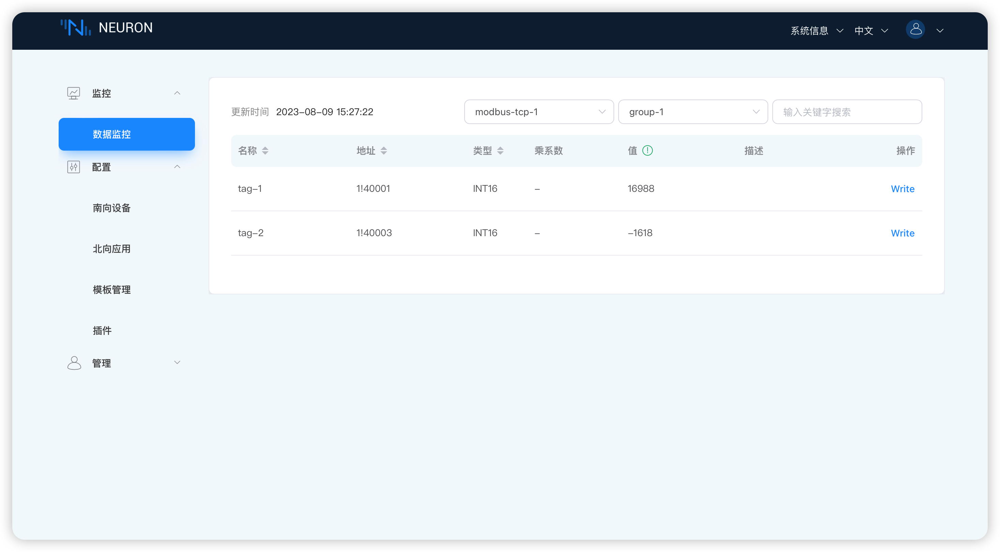

# 数据监控

在 **监控** 菜单下选择 **数据监控**，选择南向设备和组名称，查看点位数值，如下图所示。

* 南向设备：选择想要查看的南向设备，例如，选择已创建的设备 modbus-tcp-1;
* 组名称：选择想要查看的南向设备下的组，例如，选择已创建的组 group-1；
* 数据监控以组为单位显示数值，页面将会展示读取到的组底下每一个标签的值。

## 反控设备

Neuron 提供南向节点命令和控制能力。这种南向控制和命令使得能够代表以下各项向设备发出命令或动作:

* 同一实例中的其他北向节点（例如，边缘分析或规则引擎服务）
* 可能与 Neuron 实例存在于同一系统上的其他应用程序（例如，需要打开阀门的管理代理）
* 需要命令这些设备的任何外部系统（例如，基于云的应用程序，它确定需要修改一组设备上的设置）

向设备发送命令有三种方式。

* 用户可以在[仪表板监控屏幕](#界面更改值)上发出命令。
* 通过 [RESTful APIs](../api/rw.md) 传递命令。
* 任何外部系统，如基于云的平台，都可以将命令发布到特定主题，命令将被发送到 Neuron，然后发送到设备。<!--这里最好能给个例子 @QQDQ -->

### 界面更改值

当 Tag 设置了写属性时，数据监控界面的 Tag 会有一个写操作，点 **Write** 可以实现反控设备，例如，修改具有写属性的 1!40001 点位地址的值，如下图所示。

:::tip
配置点位详细信息时，必须激活写入属性。否则，就没有办法控制设备。
:::

* 单击要改值的标签末尾的 **写**按键；
* 选择是否以十六进制方式输入，不选择；
* 输入标签新值，例如，123；
* 单击 **提交** 按键提交新的值。

::: tip
设备中该点位也必须具有可写属性，否则无法写成功。
:::

### 查看设备点位值是否修改成功

打开 Modbus 模拟器，查看点位值是否变化，如下图所示。

